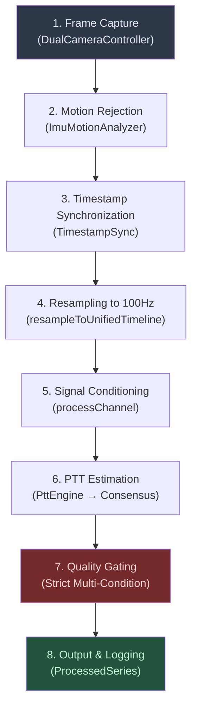

# Dual-Camera PPG → PTT: Complete Algorithm Description

> **Scope**: End-to-end pipeline from frame capture to PTT output.
> **Source of truth**: All numbers, thresholds, and formulas are read directly from the source code (Feb 2026).

---

## Pipeline Overview



---

## Stage 1 — Frame Capture

**Source**: [DualCameraController.kt](file:///home/ext.siarhei.zhmura/Work/pulse/feature-capture/src/main/java/com/vivopulse/feature/capture/DualCameraController.kt)

| Property | Face (Camera 1) | Finger (Camera 0) |
|---|---|---|
| Target FPS | Target range 15–30 fps (prefers higher) | Target range 15–30 fps (prefers higher) |
| Acceptable range | 15–30 fps | 15–30 fps |
| Image format | YUV_420_888 | YUV_420_888 |
| Timestamp source | `Image.getTimestamp()` | `Image.getTimestamp()` |

**Timestamp clock domain**: `Image.getTimestamp()` is a monotonic capture timestamp provided by the camera stack (Camera2 sensor timestamp when available). It is in the same monotonic time domain across concurrent cameras on supported devices. Verified on our supported devices by comparing against `CaptureResult.SENSOR_TIMESTAMP`.

**What is captured per frame**:
- Average RGB from ROI → `Frame(timestampNs, value=luma, r, g, b)`
- Face: ROI tracked via `FaceRoiTracker` (ML Kit face detection)
- Finger: Full-frame ROI (finger covers entire lens)

> [!IMPORTANT]
> **Corner case — No face detected**: If face ROI tracking fails, no face frames are emitted. The pipeline will receive an empty `faceData` list and return an invalid `ProcessedSeries`.

> [!WARNING]
> **Risk — Low light**: Auto-exposure extends shutter time, reducing effective FPS to 15–20. Timestamps remain accurate, but temporal resolution degrades. Mitigated by strict gating (Stage 7).

---

## Stage 2 — Motion Rejection

**Source**: [SignalPipeline.applyMotionRejection](file:///home/ext.siarhei.zhmura/Work/pulse/feature-processing/src/main/java/com/vivopulse/feature/processing/SignalPipeline.kt#L44-L74)

Frames with IMU RMS acceleration > `motionRejectionThresholdG` (default **0.1G**) are removed from both streams.

**Algorithm**:
1. For each IMU sample, check `value ≤ 0.1G` → mark timestamp as valid
2. For each face/finger frame, keep only if within **50ms tolerance** of a valid IMU timestamp
3. If ALL frames exceed threshold → keep all (fail-safe to avoid empty buffer)

| Corner Case | Behavior | Risk |
|---|---|---|
| All frames high-motion | All frames kept (no rejection) | Noisy signal → low SQI → PTT rejected at Stage 7 |
| IMU data missing/empty | No rejection applied | Motion artifacts propagate to filtering |
| High rejection rate (>50%) | Remaining frames too sparse | Effective throughput drops → may trigger FPS gating |

---

## Stage 3 — Timestamp Synchronization Analysis

**Source**: [TimestampSync.analyzeSynchronization](file:///home/ext.siarhei.zhmura/Work/pulse/feature-processing/src/main/java/com/vivopulse/feature/processing/timestamp/TimestampSync.kt#L95-L183)

This stage computes sync quality metrics but **does not modify timestamps**. No clock drift compensation or timestamp scaling is applied.

### Metrics Computed

| Metric | Definition | Threshold |
|---|---|---|
| **Offset** (ms) | Median difference of first N monotonically paired timestamps | Informational |
| **Rate** (Hz) | `(N-1) / duration_ms × 1000` (Effective Throughput) | <25 Hz triggers gate |
| **Median Cadence** (Hz) | `1000 / median_dt` (used implicitly by jitter/drop and adaptive tolerance) | Informational |
| **Jitter** (ms) | MAD of inter-frame intervals from median interval | >5 ms triggers gate |
| **Drop Rate** (fraction) | `count(dt > 1.5 × median_dt) / total_intervals` | >10% triggers gate |

### Robust Offset Estimation

**Source**: [calculateRobustOffset](file:///home/ext.siarhei.zhmura/Work/pulse/feature-processing/src/main/java/com/vivopulse/feature/processing/timestamp/TimestampSync.kt#L206-L265)

```
Algorithm:
1. WARMUP SKIP: Discard first 0.5s of each stream (cadence/latency stabilization)
2. MONOTONIC PAIRING: Cursor j starts at 0, only advances forward
   - For each stream1[i], find best stream2[j..j+5] within adaptive tolerance
   - "Best" = closest timestamp match
   - Once j advances past a frame, it never re-pairs
3. ADAPTIVE TOLERANCE: max(50ms, 1.5 × max(medianDt1, medianDt2))
   - At 30fps (33ms dt) → 50ms
   - At 15fps (66ms dt) → 99ms
   - Prevents false INVALID_OFFSET at low/mixed fps
4. MEDIAN: Take median of all valid (t2 - t1) differences
```

| Corner Case | Behavior |
|---|---|
| Short recording (<0.5s) | Fallback to pairing without warmup skip |
| Streams start at very different times | Monotonic cursor skips unmatched early frames |
| No pairs found within tolerance | `offsetValid = false` → `INVALID_OFFSET` gate triggers |

> [!NOTE]
> **Overlap vs Offset**: `overlapDuration` is computed from raw timestamps (max(starts) to min(ends)). `offsetValid` is computed by attempting to pair individual frames. It is possible to have temporal overlap but no valid pairing (e.g., massive jitter or async clocks), in which case `offsetValid=false` takes precedence.

---

## Stage 4 — Resampling to Unified 100Hz Timeline

**Source**: [TimestampSync.resampleToUnifiedTimeline](file:///home/ext.siarhei.zhmura/Work/pulse/feature-processing/src/main/java/com/vivopulse/feature/processing/timestamp/TimestampSync.kt#L285-L351)

Both streams are linearly interpolated onto a shared uniform time grid at **100 Hz** (10ms intervals).

**Algorithm**:
1. Find overlap region: `startNs = max(stream1.first, stream2.first)`, `endNs = min(stream1.last, stream2.last)`
2. Generate uniform timestamps: `t[k] = startNs + k × 10_000_000L` for `k = 0..N`
3. For each uniform timestamp, linearly interpolate both streams independently

**Why 100Hz**: Highest band edge is 4 Hz → Nyquist ≥ 8 Hz. 100 Hz gives margin for interpolation and stable derivative/foot detection. Quadratic interpolation provides sub-grid estimates; practical accuracy is typically on the order of several–tens of ms depending on fps, SNR, and motion. The strict timing/SQI gates reduce conditions where precision would be misleading.

| Corner Case | Behavior |
|---|---|
| No temporal overlap | `ResampledData.isValid = false` → pipeline returns empty `ProcessedSeries` |
| <100 unified samples | Extremely short window — PTT estimation will fail (need ≥100 for XCorr) |
| 15fps input → 100Hz output | Linear interpolation creates 6–7 synthetic points per real frame |

> [!WARNING]
> **Risk — Interpolation bias**: Linear interpolation between 30fps samples (33ms apart) introduces systematic smoothing. Near the 25fps gate boundary, this could shift peak positions on the order of ~10ms. If real-device testing reveals bias, upgrade to PCHIP (Piecewise Cubic Hermite Interpolation).

---

## Stage 5 — Signal Conditioning (`processChannel`)

**Source**: [SignalPipeline.processChannel](file:///home/ext.siarhei.zhmura/Work/pulse/feature-processing/src/main/java/com/vivopulse/feature/processing/SignalPipeline.kt#L341-L430)

Each channel (face, finger) is processed independently through 5 sub-steps:

### 5a. DC Removal + Detrending
```
zeroMean = removeMean(rawSignal)           // Subtract mean
detrended = detrendIIR(zeroMean, 0.5Hz)    // IIR high-pass at 0.5Hz
```
Removes DC offset and slow baseline wander (respiration, sensor drift).

### 5b. Zero-Phase Bandpass Filtering (`filtfilt`)
```
padLength = min(150, signal.size - 1)      // Adaptive padding
filtered = filtfilt(detrended, padLength) { signal ->
    butterworthBandpass(signal, 0.7Hz, 4.0Hz, order=4)
}
```

| Parameter | Value | Rationale |
|---|---|---|
| Low cutoff | 0.7 Hz | Below resting HR (~42 bpm) |
| High cutoff | 4.0 Hz | Above max HR (~240 bpm), includes harmonics |
| Filter order | 4 (2nd-order sections × 2) | Steep rolloff without excessive ringing |
| `filtfilt` padding | `min(150, n-1)` samples | Empirically validated via shift-invariance test |

**`filtfilt` implementation**: Signal is padded with reflected samples, filtered forward, reversed, filtered backward, then unpadded. This produces **zero phase distortion** — critical for PTT since any phase shift would directly corrupt timing.

> [!IMPORTANT]
> **Risk — Edge transients**: Insufficient padding causes filter settling artifacts at window boundaries. The old value (50 samples = 0.5s) produced up to 9.6% error. Current padding (150 samples = 1.5s) reduces this to <1%, validated by a shift-invariance test (overlap region maxDiff < 0.01).

### 5c. Wavelet Denoising (conditional)
```
if (SQI ∈ [40, 80]):   // Moderate quality only
    waveletCleaned = WaveletDenoiser.denoise(detrended, levels=4)
    denoisedFiltered = filtfilt(waveletCleaned, ...)
```
Applied only for moderate-quality signals. High-quality signals don't benefit; low-quality signals are too noisy for wavelet denoising to help.

### 5d. Step Notch Filter (walking mode only)
If `walkingModeEnabled && IMU available`: Notch filter at detected step frequency to remove walking artifacts.

### 5e. Z-Score Normalization
```
normalized = (signal - mean) / std
```
Equalizes amplitude between face and finger channels (face PPG amplitude is ~10× weaker than finger). Without this, cross-correlation would be dominated by the higher-amplitude channel.

---

## Stage 6 — PTT Estimation

**Source**: [PttEngine.computePtt](file:///home/ext.siarhei.zhmura/Work/pulse/feature-processing/src/main/java/com/vivopulse/feature/processing/ptt/PttEngine.kt#L33-L131)

### 6a. Peak Detection

**Source**: [PeakDetect.detectPeaks](file:///home/ext.siarhei.zhmura/Work/pulse/feature-processing/src/main/java/com/vivopulse/feature/processing/ptt/PeakDetect.kt#L16-L98)

```
threshold = mean + k × std     (k = 0.3)
local_maximum = signal[i] > signal[i-1] AND signal[i] > signal[i+1]
valid_peak = local_maximum AND signal[i] > threshold AND (i - lastPeak) ≥ minDistance
```

| Constraint | Value | Purpose |
|---|---|---|
| Min R-R interval | 350 ms | Max physiological HR = 170 bpm |
| Max R-R interval | 2000 ms | Min physiological HR = 30 bpm |
| Min peaks for validity | 3 | Need at least 2 R-R intervals |

### 6b. Heart Rate Computation

**Source**: [HeartRate.computeHeartRate](file:///home/ext.siarhei.zhmura/Work/pulse/feature-processing/src/main/java/com/vivopulse/feature/processing/ptt/HeartRate.kt)

```
HR (bpm) = 60000 / mean(RR_intervals_ms)
```

### 6c. PTT Consensus Engine

Two independent methods estimate PTT, then agree:

#### Method A: Global Cross-Correlation (Robust)

**Source**: [CrossCorr.crossCorrelationLag](file:///home/ext.siarhei.zhmura/Work/pulse/feature-processing/src/main/java/com/vivopulse/feature/processing/ptt/CrossCorr.kt#L13-L91)

```
1. Window: last 20s of signal
2. Max lag: ±200ms (physiological PTT range)
3. Normalized cross-correlation (Pearson):
   R[τ] = Σ(x[i]-μx)(y[i+τ]-μy) / √(Σ(x-μx)² × Σ(y-μy)²)
4. Find τ* = argmax R[τ]
5. Sub-sample refinement: Quadratic interpolation (parabola fit)
   around (τ-1, τ*, τ+1) → vertex at -b/(2a) for sub-grid estimate (useful for smoothing; practical accuracy limited by fps/SNR/jitter)
6. Peak sharpness: peak - mean(neighbors) → confidence indicator
```

| Corner Case | Behavior |
|---|---|
| <100 samples in window | Returns invalid (insufficient for correlation) |
| Flat correlation (no clear peak) | Low sharpness → low confidence at Stage 7 |
| Multiple peaks (harmonics) | Picks global max — may select wrong harmonic |

#### Method B: Foot-to-Foot Detection (Precise)

**Source**: [PTTConsensus.detectFeet](file:///home/ext.siarhei.zhmura/Work/pulse/feature-processing/src/main/java/com/vivopulse/feature/processing/ptt/PTTConsensus.kt#L76-L134)

```
1. Compute 1st derivative: diff[i] = (signal[i+1] - signal[i-1]) / 2
2. Find max slope (steepest systolic upstroke)
3. Set slope threshold: 5% of max slope
4. For each local max in derivative > threshold:
   - Search backward (up to 500ms) for local minimum in signal
   - This minimum = "foot" (pressure wave onset)
5. Match face feet to causal finger feet (Monotonic Cursor):
   - For each face foot `t_face`, search forward for first finger foot `t_finger`
   - Condition: `t_finger > t_face` AND `lag ∈ [30, 500] ms`
   - Cursor advances monotonically to ensure 1-to-1 pairing
6. Report median of all valid beat-to-beat lags
```

| Corner Case | Behavior |
|---|---|
| No feet detected / No valid pairs | Returns 0 beats → Falls back to Method A (XCorr) |
| Noisy derivative (false feet) | Threshold at 5% of max slope filters most noise |
| Beat matching ambiguity | Monotonic causal cursor prevents temporal violations |

#### Consensus Decision

```
agreement = |PTT_XCorr - PTT_FootMedian|

Output Strategy (Best-Of):
1. If Foot-to-Foot has valid beats (`nBeats > 0`) AND agrees with XCorr (`agreement ≤ 50 ms`):
   - Use **Foot-to-Foot Median** (Primary choice for precision)
   - Agreement Score = 1.0
2. If Foot-to-Foot fails (`nBeats == 0`):
   - Use **XCorr Lag** (Robust fallback)
   - Agreement Score = 1.0 (Neutral, no penalty since no disagreement)
3. If methods disagree (`agreement > 50 ms`):
   - Use **XCorr Lag** (Generally more robust to artifacts than derivative-based feet)
   - Agreement Score = 0.5 (Penalty applies, reducing confidence; disagreement suggests foot detection failure or harmonic mismatch)
```

> [!NOTE]
> The foot-to-foot value is used as the primary PTT because it corresponds to the physical onset of the pressure wave (diastolic minimum). XCorr provides a robustness check. 50ms tolerance accepts variance from 30fps sampling (33ms) and noise.

---

## Stage 7 — Quality Gating (Multi-Layer)

**Two independent gating layers** operate in sequence:

### Layer A: Timing Quality Gate (SignalPipeline)

**Source**: [SignalPipeline.kt#L255-L275](file:///home/ext.siarhei.zhmura/Work/pulse/feature-processing/src/main/java/com/vivopulse/feature/processing/SignalPipeline.kt#L255-L275)

PTT is **strictly blocked** (`effectivePtt = null`) if any condition is true:

| Condition | Threshold | Rationale |
|---|---|---|
| **Invalid Offset / No Sync** | `!offsetValid` | **Highest Priority**. If streams aren't synchronized, subsequent PTT is meaningless. |
| FPS < 25 Hz | `min(rate1, rate2) < 25` | Below ~25 fps, original cadence is too coarse and interpolation dominates |
| Jitter > 5 ms | `MAD(dt) > 5 ms` (either stream) | Non-uniform sampling corrupts interpolation accuracy |
| Drop rate > 10% | `dt > 1.5×median / total > 0.1` (either stream) | Gaps create interpolation holes in the resampled timeline |

> [!CAUTION]
> **This gate is hierarchical**: offsetValid is checked first, then FPS, then jitter, then drops. Only the first failure is reported. This means a session with both low FPS and high drops will only log `LOW_FPS` as the gate reason.

### Layer B: Signal Quality Gate (PttEngine → PttSqi)

**Source**: [PttSqi.kt](file:///home/ext.siarhei.zhmura/Work/pulse/feature-processing/src/main/java/com/vivopulse/feature/processing/ptt/PttSqi.kt)

> **Source of truth**: Validated against code as of Feb 2026; see tests `PttLiteratureConsistencyTests` for expected behavior.

Even if timing is good, PTT is rejected if signal confidence < 0.60.

#### Per-Channel SQI (0–100)

| Component | Weight | Computation |
|---|---|---|
| SNR Score | 0–70 pts | `10 × log₁₀(signal_power / noise_power)` → linear map to 0–70 |
| Regularity | 0–30 pts | `100 × (1 - CV(RR)) × 0.3` where CV = std/mean of R-R intervals |
| Motion | 0 pts (reserved) | Currently weight = 0; slot for future IMU penalty |

SNR score mapping: `{<0 dB → 0, 0 dB → 10, 5 dB → 30, 10 dB → 50, ≥15 dB → 70}`

> [!IMPORTANT]
> **SQI is intentionally conservative**: SNR is computed from the **raw (unfiltered) signal**, not the filtered one used for foot detection. This means SQI may reject sessions where filtered fiducials appear usable but raw noise remains high. This is by design — it prevents false confidence in conditions where filtering masks poor signal quality.

#### Combined Confidence (0.0–1.0)

```
confidence = (min(SQI_face, SQI_finger) / 100)
           × corrScore
           × min(1.0, peakSharpness / 0.2)
           × agreementScore
```

**Decision**: `PTT reported ↔ confidence ≥ 0.60`

If rejected, `PttEngine` generates user-facing guidance:
- Face SNR low → "Improve face lighting"
- Finger SNR low → "Reduce finger pressure on lens"
- Low correlation → "Hold both cameras steady"

---

## Stage 8 — Output & Session Logging

### ProcessedSeries Output

| Field | Type | Description |
|---|---|---|
| `faceSignal` / `fingerSignal` | `DoubleArray` | Filtered, normalized PPG signals |
| `pttOutput` | `PttOutput?` | PTT value, confidence, HR, SQI (null if gated) |
| `timeMillis` | `List<Double>` | Unified 100Hz timeline |
| `isValid` | `Boolean` | Pipeline success flag |

### SESSION_SUMMARY Log

One structured log line per `process()` call for field validation:

```
SESSION_SUMMARY | fps=29.8/28.5 | jitter=1.2/1.5ms | drops=2%/3% | offset=0.8ms (n=350) | nBeats=58 | pttGated=NONE | pttMs=125.3
```

---

## Risk Summary

| # | Risk | Severity | Mitigation | Status |
|---|---|---|---|---|
| 1 | Mis-pairing during startup | **High** | Monotonic cursor + adaptive tolerance + warmup skip | ✅ Implemented |
| 2 | Low-light FPS drop → bad PTT | **High** | Strict gate at <25 Hz (blocks PTT output) | ✅ Implemented |
| 3 | `filtfilt` edge transients | **Medium** | Adaptive padding `min(150, n-1)` + shift-invariance test | ✅ Validated |
| 4 | Interpolation bias near 25fps | **Medium** | Tracked by SESSION_SUMMARY; evaluate systematic bias by comparing lag distributions at 25–30fps | ⏳ Deferred |
| 5 | Foot-detection false positives | **Low** | 5% slope threshold + median aggregation | ✅ Implemented |
| 6 | Beat matching ambiguity | **Medium** | Beat matching ambiguity — mitigated by monotonic causal cursor + lag window; residual risk if feet detection misses beats. | ✅ Implemented |
| 7 | Clock drift between cameras | **None Expected** | Both use `SENSOR_TIMESTAMP` domain — shared monotonic clock | ✅ Verified |

---

## Definitions

| Term | Precise Definition |
|---|---|
| **Jitter** | MAD (Median Absolute Deviation) of inter-frame intervals from the median interval, per stream, in ms |
| **Drop rate** | Fraction of intervals where `dt > 1.5 × median_interval` |
| **PTT** | Time delay (ms) between pulse wave arrival at face vs. finger, estimated via consensus of XCorr and foot-to-foot methods |
| **SQI** | Signal Quality Index (0–100), combining band-limited SNR (0–70 pts) and peak regularity (0–30 pts) |
| **Confidence** | Combined metric (0.0–1.0): `min(SQI) × corrScore × sharpness × agreement`. Threshold ≥ 0.60 for reporting |
| **SENSOR_TIMESTAMP** | Camera2 frame timestamp from `CLOCK_BOOTTIME`, verified as `Image.getTimestamp()` in `DualCameraController.processFrame()` |
