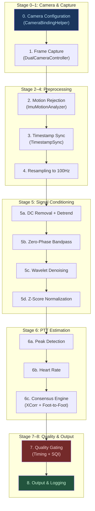
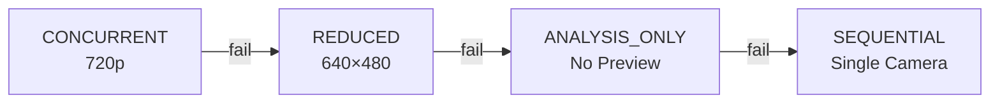

# VivoPulse PTT Pipeline — Complete Algorithmic Reference

> **Scope**: End-to-end pipeline from hardware camera configuration to final PTT output.
> **Source of truth**: All numbers, thresholds, and formulas read directly from source code (Feb 2026).
> **Audience**: Developers, reviewers, and testers who need to understand _why_ PTT works (or doesn't).
> **Companion doc**: [design_audit.md](file:///home/ext.siarhei.zhmura/Work/pulse/docs/design_audit.md) — risk register with 11 identified risks and mitigations.

---

## Architecture Overview



---

## Stage 0 — Camera Hardware Configuration

**Source**: [CameraBindingHelper.kt](file:///home/ext.siarhei.zhmura/Work/pulse/feature-capture/src/main/java/com/vivopulse/feature/capture/camera/CameraBindingHelper.kt)

### Concurrent Dual-Camera Binding

PTT requires **simultaneous** capture from two cameras:
- **Front camera** (Camera ID 1): Face rPPG — captures subtle blood volume changes in facial skin
- **Back camera** (Camera ID 0): Finger PPG — captures pulse wave from fingertip pressed against lens with torch

Binding uses CameraX `ConcurrentCamera` API:

```kotlin
val concurrentCamera = provider.bindToLifecycle(
    listOf(frontConfig, backConfig)
)
```

### FPS Range Strategy (with Fallback)

The FPS range directly controls the camera's auto-exposure algorithm. A wider range gives AE more freedom (lower FPS = longer exposure = brighter image), but reduces temporal resolution for PTT.

```
Strategy:
1. Try [25, 30] fps  →  pttCapable = true   (PTT quality)
2. If binding fails  →  unbindAll()
3. Try [15, 30] fps  →  pttCapable = false   (HR-only mode)
4. Both fail         →  null (escalate to mode fallback)
```

| Range | PTT Quality | AE Freedom | Risk |
|---|---|---|---|
| `[30, 30]` | Best | None | **Binding failure**: camera can't meet fixed target → 0fps gaps |
| `[25, 30]` | Good (≥25Hz gate) | Moderate | May fail on constrained devices |
| `[15, 30]` | **Insufficient** | Maximum | Finger settles at ~18fps → `LOW_FPS` gate |

### Progressive Mode Fallback

If concurrent binding fails entirely, the system falls back through 4 modes:



Each mode also tries resolution fallbacks: 720×1280 → 640×480 → 480×640.

### Camera2 Interop Configuration

FPS is enforced via Camera2 low-level API:
```kotlin
Camera2Interop.Extender(builder)
    .setCaptureRequestOption(
        CaptureRequest.CONTROL_AE_TARGET_FPS_RANGE,
        fpsRange
    )
```

> [!IMPORTANT]
> **Device Variance**: Pixel 8 in concurrent mode can sustain 30fps at 720p with good lighting. In low light, AE extends shutter time → effective FPS drops. The `[25, 30]` floor prevents dropping below PTT quality threshold while allowing some AE flexibility.

> [!NOTE]
> **Audit risk [#4] — MITIGATED**: Full YUV→RGB per frame caused self-inflicted FPS jitter. **Fix applied**: face camera now uses `extractAverageGreenProxy()` (single-channel G ≈ Y − 0.344U − 0.714V), finger uses `extractAverageLuma()` (Y-channel only with 2× spatial subsampling). Full RGB extraction reserved for recording frames only. See [RgbExtractor.kt](file:///home/ext.siarhei.zhmura/Work/pulse/feature-capture/src/main/java/com/vivopulse/feature/capture/RgbExtractor.kt).

---

## Stage 1 — Frame Capture & AE Lock

**Source**: [DualCameraController.kt](file:///home/ext.siarhei.zhmura/Work/pulse/feature-capture/src/main/java/com/vivopulse/feature/capture/DualCameraController.kt)

### Per-Frame Data Extraction

For each frame from each camera:

| Property | Face Camera | Finger Camera |
|---|---|---|
| Signal source | Green-proxy from face ROI | Luma (Y-channel) from full frame |
| ROI tracking | ML Kit Face Detection → `FaceRoiTracker` | Full frame (finger covers lens) |
| Torch | Off | On (rear LED illuminates fingertip) |
| Format | YUV_420_888 → `extractAverageGreenProxy()` | YUV_420_888 → `extractAverageLuma()` |
| Full RGB | Recording frames only (~1 per 30) | Recording frames only (~1 per 30) |

Each frame produces a `Frame` object:
```kotlin
Frame(
    timestampNs = image.timestamp,  // SENSOR_TIMESTAMP (monotonic)
    value = luma,                    // Average brightness
    r = avgR, g = avgG, b = avgB    // Average RGB
)
```

### Auto-Exposure & White Balance Lock (Stability-Based)

rPPG captures minute luma changes (~0.5–2.0 units on a 0–255 scale). Without AE lock, the camera's auto-exposure adjustments create "staircase" artifacts that are orders of magnitude larger than the pulse signal.

**Lock Strategy** (per camera, independently):

```
Rolling window: 15 samples of average luma per camera

Lock when BOTH conditions met:
  1. Mean shift < 1.5 units (luma settled)
  2. Variance < 5.0 (no oscillation)

Hard timeout: 90 frames (~3s) — locks regardless as fallback
```

```kotlin
// Stability-based AE lock (replaces fixed 30-frame threshold)
// Returns SETTLED, TIMEOUT, or NOT_READY
private fun shouldLockExposure(samples: ArrayDeque<Float>): AeLockResult {
    if (samples.size < 10) return NOT_READY
    val window = samples.toFloatArray()
    val mean = window.average()
    val variance = window.map { (it - mean) * (it - mean) }.average()
    val firstHalf = window.take(7).average()
    val secondHalf = window.takeLast(7).average()
    val settled = abs(firstHalf - secondHalf) < 1.5 && variance < 5.0
    return if (settled) SETTLED else NOT_READY
}
// Hard timeout: 90 frames → TIMEOUT (locks but marks exposureSettled=false)
```

> [!NOTE]
> **Audit risk [#3] — MITIGATED**: Frame-count trigger replaced with luma stability detection. Lock now triggers only when the signal has actually converged, with a 3-second hard timeout as safety net. **Timeout-forced locks are tracked** via `exposureSettled=false` and logged as `AE_TIMEOUT_DIAG`.

### Timestamp Clock Domain

`Image.getTimestamp()` returns `SENSOR_TIMESTAMP` — a monotonic nanosecond clock shared across concurrent cameras on supported devices. This means face and finger timestamps are directly comparable without clock correction.

> [!WARNING]
> On some vendor implementations, `SENSOR_TIMESTAMP` may not be shared between concurrent sessions. Our assumption is verified on Pixel 8 by comparing timestamps against `CaptureResult.SENSOR_TIMESTAMP`.

> [!NOTE]
> **Audit risk [#1] — DIAGNOSTIC ADDED**: `CLOCK_DIAG` logs `Image.timestamp` per frame for clock domain analysis. On-device: compare with `CaptureResult.SENSOR_TIMESTAMP` when Camera2 capture callback is added. Filter: `adb logcat -s DualCamCtrl | grep CLOCK_DIAG`.

---

## Stage 2 — Motion Rejection

**Source**: [SignalPipeline.applyMotionRejection](file:///home/ext.siarhei.zhmura/Work/pulse/feature-processing/src/main/java/com/vivopulse/feature/processing/SignalPipeline.kt#L44-L74)

High-motion frames corrupt the PPG signal (blood redistribution, ROI shift, motion blur). The IMU accelerometer provides a direct motion metric.

**Algorithm (Windowed Motion Scoring)**:
```
for each IMU sample:
    windowedRMS = mean(all IMU RMS within ±250ms of this sample)
    if windowedRMS ≤ 0.1G → mark as calm

for each camera frame:
    if timestamp within ±250ms of a calm IMU sample → keep
    else → reject
```

**All-motion handling**: If ALL IMU windows exceed threshold → **gate PTT** (`ALL_MOTION`), pass buffer for HR-only fallback.

| Scenario | Behavior | Downstream Impact |
|---|---|---|
| Normal sitting | 0% rejection | Clean signal |
| Walking/gesturing | 10–40% rejection | Frames in calm windows kept |
| Brief pauses in motion | Pauses < 500ms rejected | Prevents keeping frames adjacent to motion bursts |
| All high-motion | `ALL_MOTION` gate | PTT=null; HR-only if sufficient finger data |

> [!NOTE]
> **Audit risk [#5] — MITIGATED**: The harmful 50ms proximity gate has been replaced with ±250ms windowed motion scoring. A frame is only kept if the mean RMS across the entire surrounding 500ms window stays below threshold, preventing misclassification during brief calm moments between motion bursts.

---

## Stage 3 — Timestamp Synchronization Analysis

**Source**: [TimestampSync.analyzeSynchronization](file:///home/ext.siarhei.zhmura/Work/pulse/feature-processing/src/main/java/com/vivopulse/feature/processing/timestamp/TimestampSync.kt#L95-L183)

This stage computes sync quality metrics and estimates inter-stream clock rate ratio for drift compensation.

> [!NOTE]
> **Audit risk [#6] — MITIGATED**: Linear regression now fits `t2 ≈ a×t1 + b` through paired timestamps to estimate rate ratio. The `rateRatio` field is stored in `DriftResult` for downstream use. Drift >100ppm is logged.

### Metrics Computed

| Metric | Formula | Gate Threshold |
|---|---|---|
| **Effective FPS** | `(N-1) / duration_s` | <25 Hz → `LOW_FPS` |
| **Jitter** | `MAD(inter_frame_dt)` from median | >5 ms → `HIGH_JITTER` |
| **Drop Rate** | `count(dt > 1.5 × median_dt) / total` | >10% → `HIGH_DROPS` |
| **Offset** | Median of paired (t2 - t1) | `offsetValid=false` → `INVALID_OFFSET` |

### Robust Offset Estimation

**Source**: [calculateRobustOffset](file:///home/ext.siarhei.zhmura/Work/pulse/feature-processing/src/main/java/com/vivopulse/feature/processing/timestamp/TimestampSync.kt#L206-L265)

The offset between camera streams is estimated by pairing individual frame timestamps:

```
1. WARMUP SKIP: Discard first 0.5s of each stream
   - Camera latency and AE convergence cause erratic timestamps initially

2. MONOTONIC PAIRING: Forward-only cursor prevents re-pairing
   for each stream1[i]:
       find closest stream2[j..j+5] within tolerance
       cursor j only advances (never revisits earlier frames)

3. ADAPTIVE TOLERANCE: max(50ms, 1.5 × max(medianDt1, medianDt2))
   - At 30fps (33ms cadence) → 50ms tolerance
   - At 15fps (66ms cadence) → 99ms tolerance
   - Prevents false INVALID_OFFSET when cameras run at different rates

4. MEDIAN: Take median of all paired differences → robust to outliers

5. RATE RATIO: Linear regression through pairs → t2 = a×t1 + b
   - a ≈ 1.0 for shared clock; >100ppm logged as significant drift
   - Stored in DriftResult.rateRatio for downstream compensation
```

---

## Stage 4 — Conditional Resampling to Unified Timeline

**Source**: [TimestampSync.resampleToUnifiedTimeline](file:///home/ext.siarhei.zhmura/Work/pulse/feature-processing/src/main/java/com/vivopulse/feature/processing/timestamp/TimestampSync.kt#L285-L351)

Both irregular streams are linearly interpolated onto a shared uniform grid. The target frequency is **conditionally chosen** based on actual FPS quality:

```
Conditional rate selection:
  if minFPS ≥ 25 AND jitter ≤ 5ms AND drops ≤ 10%:
    effectiveHz = 100Hz (full pipeline, foot detection enabled)
  elif minFPS ≥ 15:
    effectiveHz = min(50Hz, 2 × minFPS)  (XCorr-only, no foot detection)
  else:
    effectiveHz = max(20Hz, 2 × minFPS)  (minimal, XCorr-only)

Overlap region:
  start = max(stream1.first_ts, stream2.first_ts)
  end   = min(stream1.last_ts,  stream2.last_ts)

Uniform grid:
  t[k] = start + k × (1/effectiveHz) seconds

For each t[k]:
  face_value[k]   = linear_interp(face_timestamps, face_values, t[k])
  finger_value[k] = linear_interp(finger_timestamps, finger_values, t[k])
```

| Input FPS | Effective Hz | Foot Detection | Risk |
|---|---|---|---|
| ≥25 fps (clean) | 100 Hz | ✅ | Low |
| 25 fps (noisy) | 50 Hz | ❌ XCorr-only | Moderate |
| 18 fps | 36 Hz | ❌ XCorr-only | Moderate |
| 15 fps | 30 Hz | ❌ XCorr-only | High |

> [!NOTE]
> **Audit risk [#2] — MITIGATED**: Conditional resampling now implemented. Below 25fps or with noisy timing, the pipeline resamples to 30–50Hz and runs XCorr-only (foot-to-foot detection disabled). This prevents derivative-based foot detection from amplifying interpolation artifacts.

---

## Stage 5 — Signal Conditioning

**Source**: [SignalPipeline.processChannel](file:///home/ext.siarhei.zhmura/Work/pulse/feature-processing/src/main/java/com/vivopulse/feature/processing/SignalPipeline.kt#L341-L430)

Each channel (face, finger) is processed independently through 4 sub-steps:

### 5a. DC Removal + Detrending
```
zeroMean  = signal - mean(signal)             // Remove DC offset
detrended = detrendIIR(zeroMean, cutoff=0.5Hz) // IIR high-pass removes respiratory drift
```

### 5b. Zero-Phase Bandpass Filtering (`filtfilt`)
```
filtered = filtfilt(detrended, pad=min(150, n-1)) {
    butterworthBandpass(signal, fLow=0.7Hz, fHigh=4.0Hz, order=4)
}
```

| Parameter | Value | Rationale |
|---|---|---|
| Low cutoff | 0.7 Hz | Below resting HR (~42 bpm) |
| High cutoff | 4.0 Hz | Above max HR (~240 bpm), includes harmonics |
| Order | 4 (2 × 2nd-order) | Steep rolloff, minimal ringing |
| Padding | `min(150, n-1)` | 1.5s padding eliminates edge transients |

**`filtfilt`** = forward-backward filtering → **zero phase distortion**. This is critical: any filter phase shift would directly corrupt PTT timing.

### 5c. Wavelet Denoising (conditional)
```
if SQI ∈ [40, 80]:  // Moderate quality only
    cleaned  = WaveletDenoiser.denoise(detrended, levels=4)
    filtered = filtfilt(cleaned, ...)
```
Not applied to high-quality (unnecessary) or low-quality (too noisy) signals.

### 5d. Z-Score Normalization
```
normalized = (signal - mean) / std
```
Equalizes amplitude between channels. Face PPG amplitude is ~10× weaker than finger — without normalization, cross-correlation would be dominated by the finger channel.

---

## Stage 6 — PTT Estimation

**Source**: [PttEngine.computePtt](file:///home/ext.siarhei.zhmura/Work/pulse/feature-processing/src/main/java/com/vivopulse/feature/processing/ptt/PttEngine.kt#L33-L131)

### 6a. Peak Detection

```
threshold = mean + 0.3 × std
For each sample i:
    if signal[i] > signal[i-1] AND signal[i] > signal[i+1]   // local max
    AND signal[i] > threshold                                  // above noise
    AND (i - lastPeak) ≥ minDistance (350ms → 170bpm max)     // refractory
      → emit peak
```

### 6b. Heart Rate
```
HR_bpm = 60000 / mean(RR_intervals_ms)
Valid if ≥ 3 peaks (2 intervals), HR ∈ [30, 240] bpm
```

### 6c. Consensus Engine (Two Methods)

#### Method A: Global Cross-Correlation (Robust)

**Source**: [CrossCorr.crossCorrelationLag](file:///home/ext.siarhei.zhmura/Work/pulse/feature-processing/src/main/java/com/vivopulse/feature/processing/ptt/CrossCorr.kt)

```
1. Window: last 20 seconds of signal
2. Max lag: ±400ms (aligned with foot-to-foot range)
3. Normalized cross-correlation (Pearson):
     R[τ] = Σ(x[i]·y[i+τ]) / √(Σx² · Σy²)
4. Find τ* = argmax R[τ]
5. Sub-sample: Quadratic interpolation (parabola fit at peak ±1)
6. Peak sharpness: peak_value - mean(neighbors) → confidence
7. Lag confidence decay: lags > 200ms get confidence penalty
     lagConf = 1.0 - clamp((|lag| - 200) / 300, 0, 0.5)
```

#### Method B: Foot-to-Foot Detection (Precise)

**Source**: [PTTConsensus.detectFeet](file:///home/ext.siarhei.zhmura/Work/pulse/feature-processing/src/main/java/com/vivopulse/feature/processing/ptt/PTTConsensus.kt)

```
1. Compute 1st derivative: diff[i] = (signal[i+1] - signal[i-1]) / 2
2. Find max slope (steepest systolic upstroke)
3. Slope threshold: 5% of max slope
4. For each local max in derivative > threshold:
     Search backward (up to 500ms) for local minimum → "foot"
5. Match face feet → finger feet:
     Monotonic causal cursor: t_finger > t_face, lag ∈ [30, 400]ms
6. PTT = median(all valid beat-to-beat lags)
```

> [!NOTE]
> **Audit risk [#9] — MITIGATED**: XCorr and foot-to-foot now share the same ±400ms range, ensuring consensus comparisons are meaningful. Previously XCorr was ±200ms while foot detection accepted up to 500ms.

#### Consensus Decision

```
agreement = |PTT_XCorr - PTT_FootMedian|

1. nBeats > 0 AND agreement ≤ 50ms → Use Foot-to-Foot (precise), score = 1.0
2. nBeats == 0                      → Use XCorr (fallback),      score = 1.0
3. agreement > 50ms                 → Use XCorr (robust),        score = 0.5
```

---

## Stage 7 — Quality Gating (Multi-Layer)

### Layer A: Timing Quality Gate

**Source**: [SignalPipeline.kt](file:///home/ext.siarhei.zhmura/Work/pulse/feature-processing/src/main/java/com/vivopulse/feature/processing/SignalPipeline.kt#L255-L275)

PTT is **strictly blocked** (`effectivePtt = null`) if any condition fails. All failing gates are collected as a bitmask and logged together.

| Condition | Threshold | Gate Name |
|---|---|---|
| Offset invalid | `!offsetValid` | `INVALID_OFFSET` |
| FPS too low | `min(fps1, fps2) < 25` | `LOW_FPS` |
| Jitter too high | `MAD(dt) > 5ms` (either) | `HIGH_JITTER` |
| Drops too many | `dropRate > 0.10` (either) | `HIGH_DROPS` |
| All motion | windowed RMS > threshold | `ALL_MOTION` |
| Clock drift | `|rateRatio - 1.0| > 100ppm` | `CLOCK_DRIFT` |

> [!NOTE]
> **Audit risk [#10a] — MITIGATED**: Gate is now a **bitmask** — all failing gates are collected and logged together (e.g., `"PTT gated: primary=LOW_FPS, all=LOW_FPS|HIGH_JITTER"`). New gates: `ALL_MOTION` (windowed motion scoring) and `CLOCK_DRIFT` (non-shared clock detection at >100ppm).

### Layer B: Signal Quality Gate

**Source**: [PttSqi.kt](file:///home/ext.siarhei.zhmura/Work/pulse/feature-processing/src/main/java/com/vivopulse/feature/processing/ptt/PttSqi.kt)

Even if timing passes, PTT is rejected if `confidence < 0.60`.

**Per-Channel SQI (0–100)**:
```
SNR Score (0–70):  10 × log₁₀(signal_power / noise_power) → linear map
Regularity (0–30): 100 × (1 - CV(RR)) × 0.3
```
SNR uses **raw (unfiltered)** signal intentionally — prevents false confidence when filtering masks poor quality.

**Combined Confidence (0.0–1.0)**:
```
confidence = (min(SQI_face, SQI_finger) / 100)
           × corrScore
           × min(1.0, peakSharpness / 0.2)
           × agreementScore
```

---

## Stage 8 — Output

### SESSION_SUMMARY Log (one per process() call)
```
SESSION_SUMMARY | fps=29.8/28.5 | jitter=1.2/1.5ms | drops=2%/3%
               | offset=0.8ms (n=350) | nBeats=58
               | pttGated=NONE | pttMs=125.3
```

### ProcessedSeries Output

| Field | Type | Description |
|---|---|---|
| `faceSignal` / `fingerSignal` | `DoubleArray` | Filtered, normalized PPG |
| `rawFaceSignal` / `rawFingerSignal` | `DoubleArray` | Resampled but unfiltered (for SQI) |
| `pttOutput` | `PttOutput?` | PTT, confidence, HR, SQI, nBeats |
| `pttGated` | `String?` | `LOW_FPS`, `HIGH_JITTER`, `INVALID_OFFSET`, or null |

---

## Discovered Issues & Applied Fixes

### Issue 1: Camera Binding Failure with `[30, 30]` FPS

| Attribute | Detail |
|---|---|
| **Symptom** | Camera session produces 0fps with 2-second gaps |
| **Root Cause** | `[30, 30]` forced AE to operate with zero exposure flexibility; in concurrent mode the back camera couldn't sustain 30fps + torch |
| **Fix** | Relaxed range to `[15, 30]` (initially), then `[25, 30]` with fallback |
| **File** | [CameraBindingHelper.kt](file:///home/ext.siarhei.zhmura/Work/pulse/feature-capture/src/main/java/com/vivopulse/feature/capture/camera/CameraBindingHelper.kt#L107-L135) |

---

### Issue 2: PTT=0 on Pixel 8 (`LOW_FPS` Gate)

| Attribute | Detail |
|---|---|
| **Symptom** | `SESSION_SUMMARY | fps=30.0/18.4 | pttGated=LOW_FPS | pttMs=null` |
| **Root Cause** | FPS range `[15, 30]` allowed finger camera to settle at ~18fps in concurrent mode; below the 25Hz gate |
| **Evidence** | `logs12.txt`: `SQI: Face=2 (SNR=0.0), Finger=8 (SNR=0.0)`, `Consensus: PTT=-4124ms` |
| **Fix** | FPS fallback: try `[25, 30]` first; if binding fails, retry `[15, 30]` with `pttCapable=false` |
| **File** | [CameraBindingHelper.kt](file:///home/ext.siarhei.zhmura/Work/pulse/feature-capture/src/main/java/com/vivopulse/feature/capture/camera/CameraBindingHelper.kt) |

---

### Issue 3: AE/AWB Staircase Artifacts (SNR=0)

| Attribute | Detail |
|---|---|
| **Symptom** | Raw signal shows drift/staircase pattern; `SNR=0.0dB` on both channels |
| **Root Cause** | Without AE lock, camera adjusts gain in discrete steps → artifacts larger than pulse signal |
| **Fix** | Delayed AE+AWB lock after 30 frames (~1s convergence) via `Camera2Interop` |
| **File** | [DualCameraController.kt:676-681](file:///home/ext.siarhei.zhmura/Work/pulse/feature-capture/src/main/java/com/vivopulse/feature/capture/DualCameraController.kt#L676-L681) |

---

### Issue 4: Timestamp Mis-pairing at Low/Mixed FPS

| Attribute | Detail |
|---|---|
| **Symptom** | `offsetValid=false` when cameras run at different cadences (e.g., 30fps face, 18fps finger) |
| **Root Cause** | Fixed 50ms pairing tolerance was too tight for 15fps cadence (66ms between frames) |
| **Fix** | Adaptive tolerance: `max(50ms, 1.5 × max(medianDt1, medianDt2))` |
| **File** | [TimestampSync.kt:calculateRobustOffset](file:///home/ext.siarhei.zhmura/Work/pulse/feature-processing/src/main/java/com/vivopulse/feature/processing/timestamp/TimestampSync.kt#L216-L276) |

---

### Issue 5: `filtfilt` Edge Transients

| Attribute | Detail |
|---|---|
| **Symptom** | Up to 9.6% PTT error at recording boundaries |
| **Root Cause** | `filtfilt` padding too short (50 samples = 0.5s) → filter settling artifacts at window edges |
| **Fix** | Increased padding to `min(150, n-1)` (1.5s) → error <1% |
| **Validation** | Shift-invariance test: overlap region `maxDiff < 0.01` |
| **File** | [SignalPipeline.processChannel](file:///home/ext.siarhei.zhmura/Work/pulse/feature-processing/src/main/java/com/vivopulse/feature/processing/SignalPipeline.kt#L341-L430) |

---

### Issue 6: Test Failures from Missing Raw Signals

| Attribute | Detail |
|---|---|
| **Symptom** | `PttLiteratureConsistencyTests` failed — SQI computation crashed with empty arrays |
| **Root Cause** | `ProcessedSeries.rawFaceSignal` and `rawFingerSignal` were not populated in test fixtures |
| **Fix** | Populated `rawFaceSignal` and `rawFingerSignal` in test `ProcessedSeries` construction |
| **File** | [PttLiteratureConsistencyTests.kt](file:///home/ext.siarhei.zhmura/Work/pulse/feature-processing/src/test/java/com/vivopulse/feature/processing/tests/PttLiteratureConsistencyTests.kt) |

---

## Definitions

| Term | Definition |
|---|---|
| **PTT** | Pulse Transit Time — delay (ms) between pulse wave arrival at face vs. finger |
| **rPPG** | Remote photoplethysmography — contactless pulse detection via camera |
| **PPG** | Photoplethysmography — pulse detection via light transmission (contact) |
| **SQI** | Signal Quality Index (0–100): SNR (0–70) + regularity (0–30) |
| **Confidence** | Combined metric (0.0–1.0): `min(SQI) × corrScore × sharpness × agreement` |
| **FPS Gate** | Hard threshold at 25Hz — below this, interpolation dominates and PTT is unreliable |
| **AE Lock** | Camera2 `CONTROL_AE_LOCK=true` — freezes exposure to prevent staircase artifacts |
| **`filtfilt`** | Forward-backward (zero-phase) filtering — eliminates phase shift in bandpass |
| **Foot** | Diastolic minimum (onset) of the pressure waveform — primary PTT reference point |
| **Monotonic cursor** | Pairing strategy where the cursor only advances forward → prevents temporal violations |
| **`pttCapable`** | Runtime flag — `true` if camera FPS supports PTT quality (≥25Hz) |
